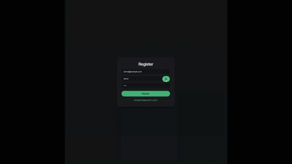

# Saver

A minimalist habit-savings tracker. Log when you skip a purchase or habit (coffee run, takeout, impulse shopping) and Saver tracks how much you've saved, your streaks, and surfaces which habit is paying off the most.



## Why I built this

I wanted a project that went beyond CRUD boilerplate — something with real calculation logic (streaks, aggregation across habits) and a full auth flow, built end to end by hand. It's also my first project using Python/FastAPI instead of Java/Spring Boot, to diversify my stack.

## Features

- **JWT authentication** — register/login, tokens issued and verified with PyJWT, passwords hashed with bcrypt
- **Habit CRUD** — create, view, and delete habits with a typical cost per skip
- **Entry logging** — mark a habit "skipped today" or log a missed day for a past date, with an editable per-entry amount
- **Streaks & summary** — total saved, times skipped, and longest streak calculated per habit and across all habits
- **Insight card** — automatically surfaces your strongest habit based on savings and streak

## Tech stack

**Backend:** Python, FastAPI, SQLAlchemy, SQLite, PyJWT, Passlib (bcrypt)
**Frontend:** React, plain CSS

## Running it locally

### Backend

```bash
git clone https://github.com/edgarordonezz/saver.git
cd saver
python -m venv venv
source venv/bin/activate
pip install -r requirements.txt
```

Create a `.env` file in the project root with a secret key:
```
SECRET_KEY=your-secret-key-here
```

Then start the API:
```bash
uvicorn main:app --reload
```
The backend runs at `http://localhost:8000`. Interactive API docs are available at `http://localhost:8000/docs`.

### Frontend

```bash
cd frontend
npm install
npm start
```
The frontend runs at `http://localhost:3000`.

## What's next

- Entry editing/deletion on the frontend (backend routes already exist)
- "Saved vs. spent" comparison view
- Docker containerization and deployment
- Accessibility pass

## Author

Edgar Ordonez — [GitHub](https://github.com/edgarordonezz)
